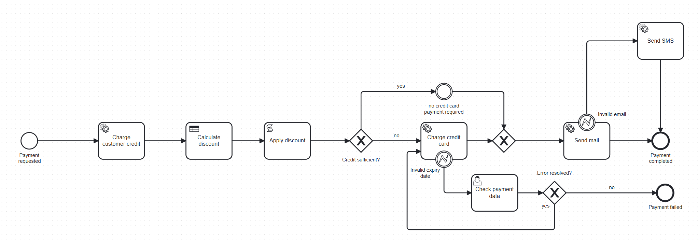

#  Process Payments - Camunda BPM Project

## 1. Giới thiệu
Dự án **Process Payments** là một ứng dụng Spring Boot tích hợp với **Camunda BPM** nhằm mô phỏng và tự động hóa quy trình xử lý thanh toán.  
Ứng dụng được xây dựng với Camunda, hỗ trợ triển khai bằng Zeebe Client, Java Spring Boot.

---

## 2. Các tính năng chính
- Quản lý quy trình nghiệp vụ thanh toán bằng BPMN (Business Process Model and Notation).  
- Tích hợp Camunda Engine để thực thi workflow khi khởi tạo chương trình.  
-  REST API cho phép khởi tạo và theo dõi tiến trình.  
-  Biểu đồ BMPN 2.0 với Service Task, User Task,...  

---

## 3. Sơ đồ BPMN & Giải thích

### 📌 Sơ đồ quy trình thanh toán credit

